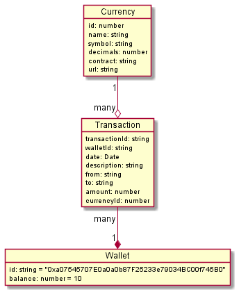

# BSC Payments Processor

## Entidades

1. **Billetera (Wallet).** Representa a la billetera del usuario, y tendrá asociada una lista de movimientos. A su vez, tendrá el saldo de la misma.
2. **Movimiento (Transaction).** Los movimientos serán tanto de ingreso como de egreso. Los ingresos sumarán saldo a la Wallet, mientras que los egresos lo restarán.
3. **Moneda (Currency).** Las monedas son las distintas Stablecoins que se aceptarán en los pagos.

## Modelo Relacional

## Stablecoins

BUSD:
* Nombre: BUSD Token
* Símbolo: BUSD
* Decimales: 18
* Contrato: 0xe9e7cea3dedca5984780bafc599bd69add087d56
* Url: https://www.bscscan.com/token/0xe9e7cea3dedca5984780bafc599bd69add087d56
  
USDT:
* Nombre: BSC-USD
* Símbolo: USDT
* Decimales: 18
* Contrato: 0x55d398326f99059ff775485246999027b3197955
* Url: https://bscscan.com/token/0x55d398326f99059ff775485246999027b3197955

USDC:
* Nombre: USD Coin
* Símbolo: USDC
* Decimales: 18
* Contrato: 0x8ac76a51cc950d9822d68b83fe1ad97b32cd580d
* Url: https://bscscan.com/token/0x8ac76a51cc950d9822d68b83fe1ad97b32cd580d

DAI:
* Nombre: Dai Token
* Símbolo: DAI
* Decimales: 18
* Contrato: 0x1af3f329e8be154074d8769d1ffa4ee058b1dbc3
* Url: https://bscscan.com/token/0x1af3f329e8be154074d8769d1ffa4ee058b1dbc3