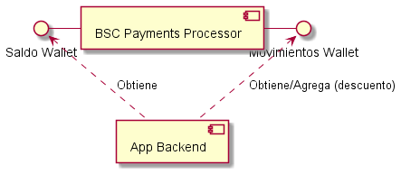
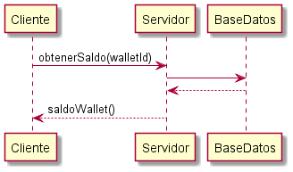
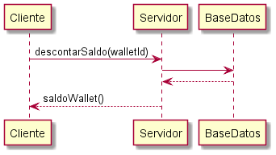
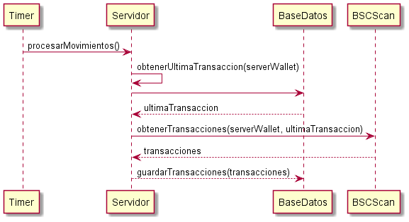

# BSC Payments Processor

## 1. Qué haremos?
### 1.1. La idea
Desarrollar un MicroServicio que se encargue de procesar pagos de Binance Smart Chain y manejar el saldo de cada cuenta asociada a una billetera (wallet).
Este MicroServicio (BSC Payments Processor) será consumido por el backend de cualquier aplicación que se quiera desarrollar.

### 1.2. Ejemplo
Para este ejemplo, el Backend permitirá al usuario descargar determinados archivos si previamente realizó el pago por ellos.

## 2. BSC Payments Processor
### 2.1. Alcance
Registrar pagos recibidos en stablecoins (USDT, USDC, BUSD, DAI), sumando a su vez saldo a la billetera.
Descontar saldo de billeteras (no importa el motivo). Podrían ser por compra de productos, pago de subscripciones, etc.

### 2.2. API
##### 2.2.1. Obtener saldo de Wallet

##### 2.2.2. Descontar saldo

### 2.3. Funcionamiento Interno
##### 2.3.1. Procesar movimientos

## Entidades
* Cliente: aplicación backend que consume el MicroServicio desarrollado.
* Servidor: el MicroServicio BSC Payments Processor.
* Base de datos: base de datos SQL.

## Requisitos
* NodeJS.
* Motor de base de datos SQL.
* Cuenta en BSCScan (gratuita nos sirve).

